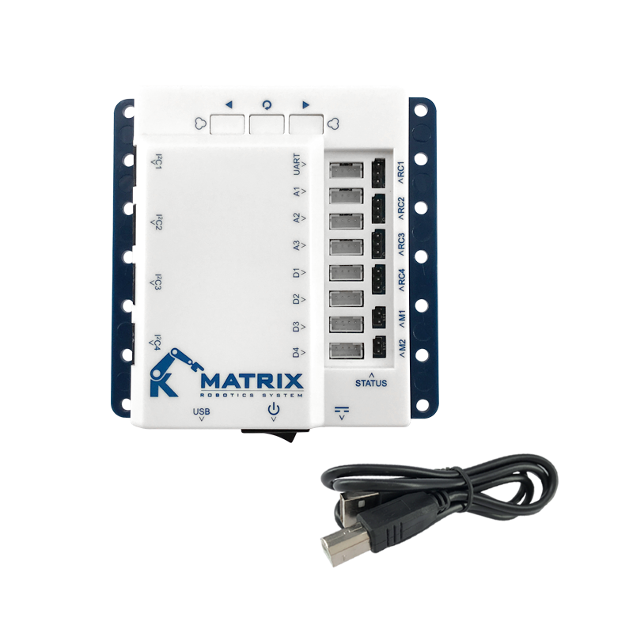

# python with MatrixMini

1 [硬體需求](./硬體需求)

2 [軟體安裝](./軟體安裝設定)

3 [python基礎與資料輸出](./python基礎與資料輸出)

4 [數值計算與資料輸入](./數值計算與資料輸入)

5 [條件分析](./條件分析)

6 [重複執行](./重複執行)

7 [字串處理](./字串處理)

8 [python內建的資料結構](./python內建的資料結構)

9 [函式和comprehension](./函式和comprehension)

10 [數值與函數進階運用](./數值與函數進階運用)
